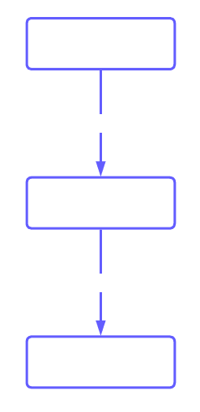
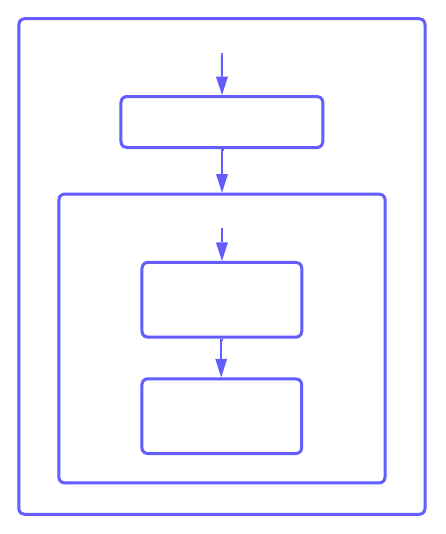

TL:DR start [here](#updated-threat-modeling)

When I first started my homelab journey, I didn't think much about securing the services I was deploying. I was more concerned with getting the thing to work more than anything else. As I grew more confident wrangling the applications into doing what I wanted, I started to look for other areas I could improve my skills and the fruits of my labor. 

Even though I've been interested in cybersecurity since early college, I hadn't applied that part of my brain to the homelab part of my brain. I thought, "So what if I have holes poked in my firewall and HTTP servers on my LAN?" While I don't think it's the worst thing in the world, I thought it was hypocritical of me to be running services at home insecurely while technically being a cybersecurity professional. On top of that, it'd be a great opportunity to get more "real-world" experience (even if it is just at home). 

## Network structure
My homelab at the time of writing is pretty straightforward. OPNsense box, wireless AP, PiHole running DNS and DHCP, Proxmox server, a NAS, and a few Docker containers. Easy to manage and (theoretically) easy to rebuild when things go wrong. 

There are only a few machines in my lab and none of them have weird or unreliable software on them, so I don't worry about updates breaking anything. This frees me to apply patches as soon as they're available (with a quick Ansible playbook to save me some time), so patch management isn't something I'll focus on in this post. I've spent enough time in my professional life worrying about that. 

## Risk analysis
As mentioned in the intro, I'd done at least a bit of threat modeling with my homelab. Having a flat network with somewhat implicit trust is definitely a risk, but it's something I tolerate for the moment. I'm more worried about getting dragged into mass scans on Shodan than an intelligent hacker hacking into a Docker container. My internal network may not be perfect, but I have some mitigations in place. I access everything over SSH and disable password authentication and I only use the 5ghz wireless band with reduced broadcast strength to limit the coverage area (and attack surface). Admittedly this doesn't mitigate the damage of a server VM or container being compromised, but at that point I'm in over my head anyways.

## Updated threat modeling
When I was first learning networking, I forwarded ports on my router to various services like a Minecraft server, iPerf3, and simple web servers. Never for an extended amount of time, but I'm sure they got picked up by scanners and were sent malicious traffic. When I realized the risks associated with running services open to the world, I limited my port forwarding to just my Plex server. Unfortunately, after seeing that Plex servers were [being used in DDoS amplification attacks](https://www.bitdefender.com/blog/hotforsecurity/ddos-services-use-plex-media-servers-amplify-attacks), I decided to not open the default port to the world. In order to maintain remote access to the server, I would have to open it up somehow, but some hardening (or at least obfuscation) would make me feel better. 

## Solution
I migrated my DNS provider from Namecheap to Cloudflare to give me access to their numerous security tools. I set up a [tunnel](https://developers.cloudflare.com/cloudflare-one/connections/connect-apps/) from Cloudflare's network to my own using their [developer documentation](https://developers.cloudflare.com/cloudflare-one/connections/connect-apps/install-and-setup/tunnel-guide#set-up-a-tunnel-locally-cli-setup). The benefits of this are that 1) Internet traffic sent through the tunnel is relayed from Cloudflare to my home network, which keeps my true IP address from being stored in a DNS record and 2) I don't have to forward any ports from WAN &#8594; LAN since the tunnel goes through my firewall. I experimented with applying extra security policies like IP range blocking and enforcing email 2FA, but doesn't fit my use case. Still neat.

I pointed the tunnel to my Nginx Proxy Manager Docker container that runs my reverse proxy to a Docker network with various servers. This Docker network doesn't expose any ports to LAN except 443 and 81, both of which are required for the reverse proxy. I configured split DNS for this Plex host as well, which means that my internal DNS points requests for Plex to its internal IP (so traffic doesn't go all the way to Cloudflare's edge and back) and WAN DNS points to the Cloudflare tunnel.

### WAN traffic


### LAN traffic

